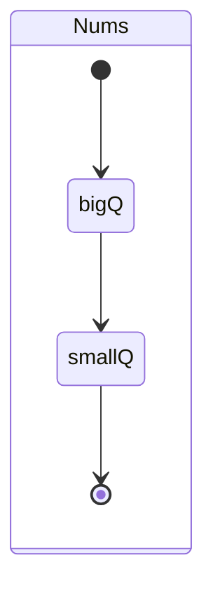

[toc]

# 295. Find Median from Data Stream

> https://leetcode.com/problems/find-median-from-data-stream

> Median is the middle value in an ordered integer list. If the size of the list is even, there is no middle value. So the median is the mean of the two middle value.

## Approach 1 : Two Priority Queues




```cpp
class MedianFinder {
	priority_queue<int> bigQ;
	priority_queue<int, vector<int>, greater<int>> smallQ;
public:
	/** initialize your data structure here. */
	MedianFinder() {
	}

	void addNum(int num) {
		if (bigQ.size() == 0) {	//!!!
			bigQ.push(num);
			return;
		}
		if (bigQ.size() == smallQ.size()) {
			if (bigQ.top() < num) smallQ.push(num);
			else bigQ.push(num);
		}

		else if (bigQ.size() > smallQ.size()) {

			if (bigQ.top() < num) smallQ.push(num);
			else {
				smallQ.push(bigQ.top());
				bigQ.pop();
				bigQ.push(num);
			}
		}
		else {
			//bigQ.size() <  smallQ.size()
			if (smallQ.top() > num) bigQ.push(num);
			else {
				bigQ.push(smallQ.top());
				smallQ.pop();
				smallQ.push(num);
			}

		}

	}

	double findMedian() {

		if (bigQ.size() == smallQ.size()) {
			return double(bigQ.top() + smallQ.top()) / 2;
		}

		return bigQ.size() > smallQ.size() ? bigQ.top() : smallQ.top();
	}
};

```

>Runtime: 144 ms, faster than 96.47% of C++ online submissions for Find Median from Data Stream.
>
>Memory Usage: 42.4 MB, less than 100.00% of C++ online submissions for Find Median from Data Stream.

### Complexity

* Time complexity : $O(3 * log n) ≈ O(log n)$  
  - At worst , there are three time of heap insertion and deletion. Each of the operation takes about $O(logn)$ .
  - Finding the mean takes constant $O(1)$ times since the tops of the two heaps are directly accessible.
* Space complexity :  $O(n)$
  - $n$ space to hold input in containers.

## Approach 2 :  Two Priority Queues - Less Efficiency

```cpp
class MedianFinder {
	priority_queue<int> bigQ;
	priority_queue<int, vector<int>, greater<int>> smallQ;
public:
	/** initialize your data structure here. */
	MedianFinder() {

	}

	void addNum(int num) {
		int tmp;
		bigQ.push(num);
		smallQ.push(bigQ.top());
		bigQ.pop();
		if (smallQ.size() - bigQ.size() > 1) {
			bigQ.push(smallQ.top());
			smallQ.pop();
		}
	}

	double findMedian() {
		if (bigQ.size() == smallQ.size()) {
			return ((double)bigQ.top() + (double)smallQ.top()) / 2;
		}
		return smallQ.top();
	}
};
```

> Runtime: 220 ms, faster than 20.01% of C++ online submissions for Find Median from Data Stream.
>
> Memory Usage: 42.4 MB, less than 100.00% of C++ online submissions for Find Median from Data Stream.

## Summary

### 1. c++ : default max heap  java: default min heap

### 2. c++: `priority_queue<int, vector<int>, greater<int>> smallQ;`

### 3. int -> double `   return double(bigQ.top() + smallQ.top()) / 2;`

