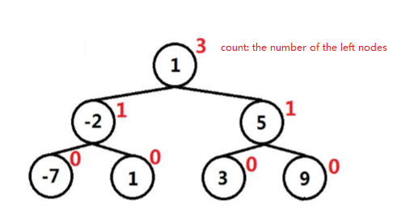
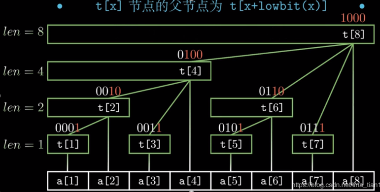

[TOC]

# 315. Count of Smaller Numbers After Self

> https://leetcode.com/problems/count-of-smaller-numbers-after-self/

> You are given an integer array *nums* and you have to return a new *counts* array. The *counts* array has the property where `counts[i]` is the number of smaller elements to the right of `nums[i]`.


## Approach 1:  Divide and Conquer

### Diagram


```java
class Solution {

    class Pair {
        int first;
        int second;

        Pair(Pair pair) {
            this.first = pair.first;
            this.second = pair.second;
        }
        Pair(int first, int second) {
            this.first = first;
            this.second = second;
        }
    }

    public List<Integer> countSmaller(int[] nums) {
        int[] result = new int[nums.length];
        List<Pair> vec = new ArrayList<>(nums.length);
        for (int i = 0; i < nums.length; i++) {
            vec.add(new Pair(nums[i], i));
        }
        merge_sort(vec, result);

        List<Integer> res = new ArrayList<>();
        for (int i : result) res.add(i);

        return res;
    }


    private void merge_sort(List<Pair> vec, int[] result) {
        int size = vec.size();
        if (size < 2) {
            return;
        }
        int mid = size / 2;
        List<Pair> vec1 = new ArrayList<>();
        List<Pair> vec2 = new ArrayList<>();

        for (int i = 0; i < mid; i++) {
            vec1.add(new Pair(vec.get(i)));
        }
        merge_sort(vec1, result);

        for (int i = mid; i < vec.size(); i++) {
            vec2.add(new Pair(vec.get(i)));
        }
        merge_sort(vec2, result);

        vec.clear();
        merge(vec1, vec2, vec, result);

    }

    private void merge(List<Pair> vec1, List<Pair> vec2, List<Pair> vec, int[] result) {

        int i = 0, j = 0;
        while (i < vec1.size() && j < vec2.size()) {
            if (vec1.get(i).first > vec2.get(j).first) {
                vec.add(vec2.get(j));
                j++;
            } else {
                vec.add(vec1.get(i));
                result[vec1.get(i).second] += j;
                i++;
            }
        }

        for (; i < vec1.size(); i++) {
            vec.add(vec1.get(i));
            result[vec1.get(i).second] += j;
        }

        for (; j < vec2.size(); j++) {
            vec.add(vec2.get(j));
        }
    }
}

```

>Runtime: 30 ms, faster than 26.04% of Java online submissions for Count of Smaller Numbers After Self.
>
>Memory Usage: 58.4 MB, less than 5.55% of Java online submissions for Count of Smaller Numbers After Self.


## Approach 2:  Binary Search Tree

### Diagram




```java
class Solution {
    class Node {
        int count; // the number of the left nodes
        int val;
        Node left;
        Node right;
        Node(int val) {
            left = null;
            right = null;
            this.val = val;
            this.count = 0;
        }
    }

    class OUTPUT {
        int count;
    }

    public List<Integer> countSmaller(int[] nums) {
        List<Integer> ret = new ArrayList<Integer>();
        if (nums.length == 0) return ret;

        Node root = new Node(nums[nums.length - 1]);
        ret.add(root.count);
        for (int i = nums.length - 2; i >= 0; i--) {
            Node newNode = new Node(nums[i]);
            OUTPUT item = new OUTPUT();
            insert(root, newNode, item);
            ret.add(item.count);
        }
        Collections.reverse(ret);
        return ret;
    }

    void insert(Node root, Node newNode, OUTPUT small_count) {

        if (newNode.val <= root.val) {
            root.count++;
            if (root.left != null)
                insert(root.left, newNode, small_count);
            else
                root.left = newNode;
        } else {
            small_count.count += root.count + 1; // 1 means root itselft
            if (root.right != null) {
                insert(root.right, newNode, small_count);
            } else {
                root.right = newNode;
            }
        }
    }
}
```

> Runtime: 12 ms, faster than 49.48% of Java online submissions for Count of Smaller Numbers After Self.
>
> Memory Usage: 51.9 MB, less than 5.55% of Java online submissions for Count of Smaller Numbers After Self.


## Approach 3:  Binary Index Tree

### Diagram



```java
class Solution {
    public List<Integer> countSmaller(int[] nums) {
        Integer[] ret = new Integer[nums.length];
        Set<Integer> set = new TreeSet<>();
        for(int i: nums) set.add(i);
        Map<Integer, Integer> map = new HashMap<>();
        int j = 0;
        for(Integer i: set) {
            map.put(i, ++j);
        }        
        BIT tree = new BIT(set.size());
        int index;
        for(int i=nums.length -1; i>=0; i--) {
            index = map.get(nums[i]);
            ret[i] = tree.sum(index-1);
            tree.update(index, 1);
        } 
        return Arrays.asList(ret);
    }
}

class BIT {
    private int[] count;
    BIT(int size){
        count = new int[size+1];
    }
    
    public void update(int index, int val) {        
        while(index < count.length) {
            count[index] += val;
            index += lowestBit(index);
        }
    }
    
    public int sum(int index) {
        int ret = 0;
        while(index > 0) {
            ret += count[index];
            index -= lowestBit(index);
        }
        return ret;
    }
    
    private int lowestBit(int x) {
        return x & -x;
    } 
}
```

>Runtime: 21 ms, faster than 31.49% of Java online submissions for Count of Smaller Numbers After Self.
>
>Memory Usage: 52.3 MB, less than 5.55% of Java online submissions for Count of Smaller Numbers After Self.


## Summary

### 1.  Java：how to write down int as parameter ？

```java
class OUTPUT {
	int count;
}
```


