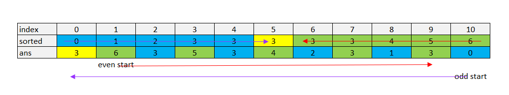

# 324. Wiggle Sort II

> https://leetcode.com/problems/wiggle-sort-ii/

> Given an unsorted array `nums`, reorder it such that `nums[0] < nums[1] > nums[2] < nums[3]...`.

## Approach 1 : Sort + Reorder

1. Sort the array
2. 



```cpp
class Solution {
public:
    void wiggleSort(vector<int>& nums) {
        if(nums.size()<=1) return;
        sort(nums.begin(), nums.end());
        int len = nums.size(), k = 1, high = (len%2)?len-1:len-2, mid=nums[len/2];
        vector<int> ans(len, mid);
        for(int i = len-1; i >=0 && nums[i]>mid; i--, k+=2)
            ans[k] = nums[i];
        for(int i = 0; i < len && nums[i]<mid; i++, high-=2)
            ans[high] = nums[i];
        nums = ans;
    }
};
```

> Runtime: 72 ms, faster than 71.21% of C++ online submissions for Wiggle Sort II.
>
> Memory Usage: 11.4 MB, less than 38.46% of C++ online submissions for Wiggle Sort II.

## Approach 2 ： nth_element() + 3 way partition 没看懂

```cpp

class Solution {
public:
    void wiggleSort(vector<int>& nums) {
        int n = nums.size();

        // Find a median.
        auto midptr = nums.begin() + n / 2;
        nth_element(nums.begin(), midptr, nums.end());
        int mid = *midptr;

        // Index-rewiring.
        #define A(i) nums[(1+2*(i)) % (n|1)]

        // 3-way-partition-to-wiggly in O(n) time with O(1) space.
        int i = 0, j = 0, k = n - 1;
        while (j <= k) {
            if (A(j) > mid)
                swap(A(i++), A(j++));
            else if (A(j) < mid)
                swap(A(j), A(k--));
            else
                j++;
        }
    }
};
```

