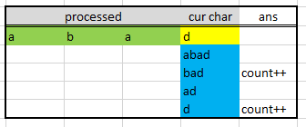
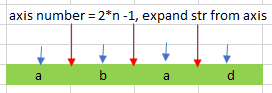
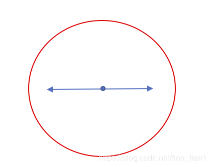
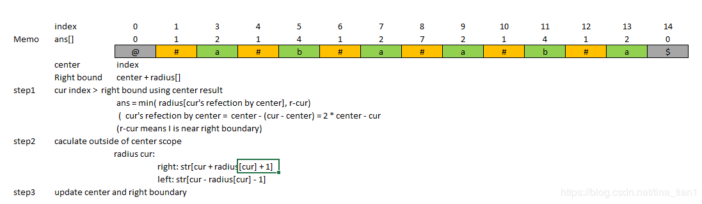
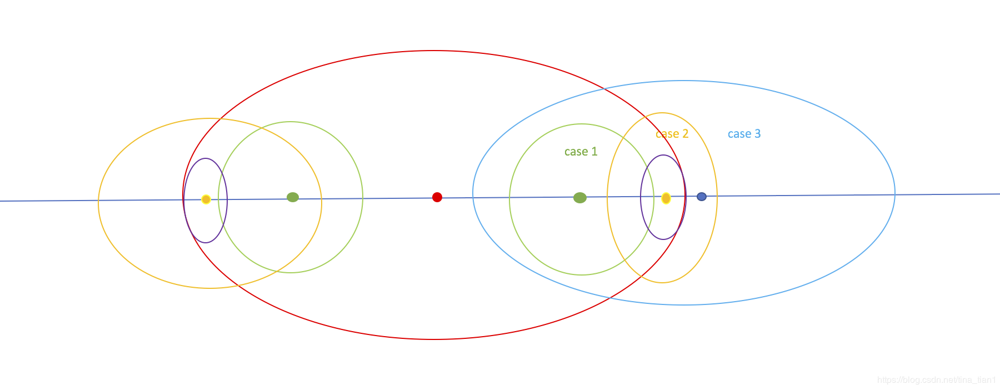

[toc]

# 647. Palindromic Substrings

> https://leetcode.com/problems/palindromic-substrings/

> Given a string, your task is to count how many palindromic substrings in this string.
>
> The substrings with different start indexes or end indexes are counted as different substrings even they consist of same characters.

## Approach 1 : DP - New Character + Previous String



```cpp
class Solution {
public:
	int countSubstrings(string s) {
		return helper(s, s.size() - 1);
	}
 
	int helper(string &s, int end) {
 
		if (-1 == end) return 0;
 
		int count = 0;
		for (int i = 0; i <= end; i++)
			if (isP(s, i, end)) count++;
 
		return helper(s, end - 1) + count;
	}
 
	bool isP(string &s, int start, int end) {
		while (start <= end)
			if (s[start++] != s[end--]) return false;
 
		return true;
	}
};
```

> untime: 196 ms, faster than 14.08% of C++ online submissions for Palindromic Substrings.
>
> Memory Usage: 8.7 MB, less than 56.00% of C++ online submissions for Palindromic Substrings.

### Add Cache

```cpp
class Solution {
public:
	int countSubstrings(string s) {
        int n = s.length();
        if(n == 0) return 0;
        vector<vector<bool>> dp(n+1, vector<bool>(n+1, false));
		return helper(s, 0, dp);
	}
 
	int helper(string &s, int end, vector<vector<bool>> &dp) {
		if (s.length() == end) return 0;
		int count = 0;
		for (int i = 0; i <= end; i++) {
            if(s[i] == s[end] && (end - i <= 2 || 
                                  (end - i > 2 && dp[i + 1][end - 1]))) {
                count++;
                dp[i][end] = true;
            }
            else {
                dp[i][end] = false;
            }
        }
		return helper(s, end + 1, dp) + count;
	}
};
```

> Runtime: 28 ms, faster than 30.18% of C++ online submissions for Palindromic Substrings.
>
> Memory Usage: 10.7 MB, less than 32.00% of C++ online submissions for Palindromic Substrings.

## Approach 2 : Axis

### Diagram





```cpp
class Solution {
public:
    int countSubstrings(string s) {
        int axisNum = 2 * s.size() - 1;
        int left = 0, right = 0, ans = 0;
        
        for(int i = 0; i < axisNum; i++) {
            left = i/2;
            right = left + i%2;
            while (left>=0 && right<s.size() && s[left--] == s[right++])  ans++;
        }
        
        return ans;
    }
};
```

> Runtime: 4 ms, faster than 91.89% of C++ online submissions for Palindromic Substrings.
>
> Memory Usage: 8.6 MB, less than 76.00% of C++ online submissions for Palindromic Substrings.

## Approach 3: Manacher's Algorithm

### Diagram





```cpp
class Solution {
public:
    int countSubstrings(string s) {   
        int ret = 0;       
        vector<char> str(2*s.size() + 3, 0);
        vector<int> redius(2*s.size() + 3, 0);
        
        int center = 0, right = 0;
        
        str[0] = '@';
        str[1] = '#';
        int j = 2;
        for (int i=0; i<s.size(); i++){
           str[j++] = s[i];
           str[j++] = '#'; 
        } 
        str[j++] = '$';    
        
        for(int i=2; i<str.size()-2; i++){
            
            //reduce repeated calculate by using previous result;
            if (i<right)  redius[i] = min(right -i, redius[2*center - i]);
            
            //calculate outside of right boundary            
            while (str[i + redius[i] + 1] == str[i - redius[i] - 1]) redius[i]++;
            
            if (i + redius[i] > right) {
                right = i + redius[i];
                center = i;
            }
        }
       
        // +1 means the charactor itself;
        for (int e: redius) ret += (e+1)/2;
        
        return ret;
    }
};
```

> Runtime: 4 ms, faster than 91.89% of C++ online submissions for Palindromic Substrings.
>
> Memory Usage: 8.9 MB, less than 52.00% of C++ online submissions for Palindromic Substrings.