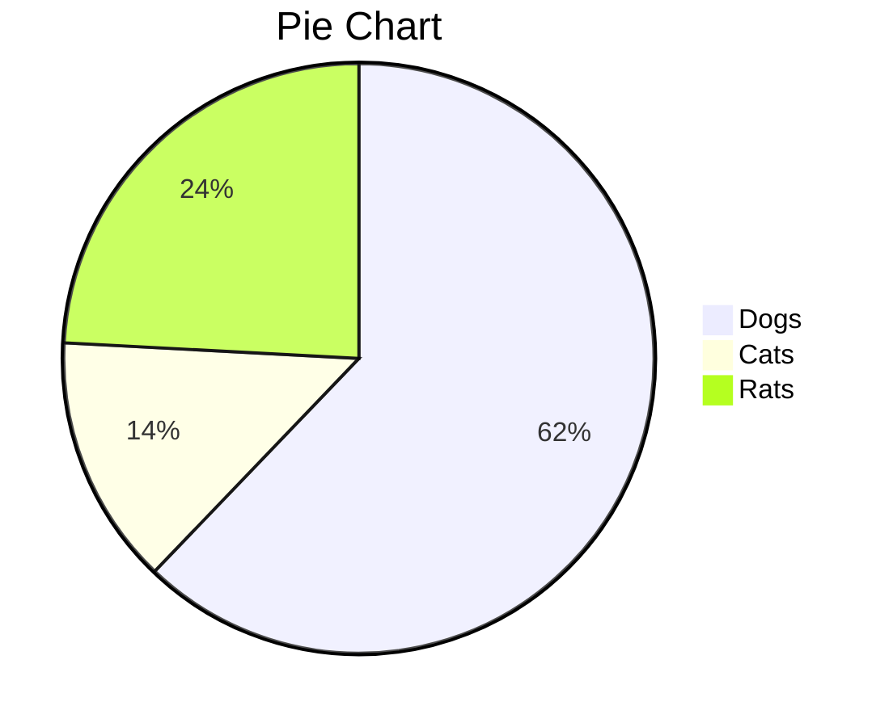
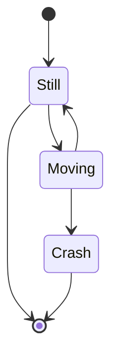

[toc]

# Summary

https://www.jianshu.com/p/b30955885e6d

## 1. 加粗

两个`**`或`__`会被HTML中的``标签包裹，例如：

## 2. Markdown中如何添加特殊符号

>  List of Greek letters and math symbols
>
> https://www.overleaf.com/learn/latex/List_of_Greek_letters_and_math_symbols

> https://blog.csdn.net/Logicr/article/details/82414854

```
&rarr;
```

**→**

 eg:     $\vee$ 	

```      $\vee$ 	
      $\vee$ 	
```

## 3. Markdown数学公式语法

https://www.codecogs.com/latex/eqneditor.php

https://juejin.im/post/5a6721bd518825733201c4a2#heading-7

\\(a + b\\)

```
$x + y = z$ 
```


$$

$$

$x+y=z$

```
  $=2*3^k = 2*3^{log_3 m*n} = 2*m*n$ 
  //Suppose $m*n = 3^k$ &rarr; $k = \log_3 m*n,$
```

  $=2*3^k = 2*3^{log_3 m*n} = 2*m*n$ 

//Suppose $m*n = 3^k$ &rarr; $k = \log_3 m*n,$

> https://www.jianshu.com/p/e74eb43960a1

### 空格

http://blog.sina.com.cn/s/blog_4ddef8f80100iwwv.html

| 两个quad空格 | a \qquad b |  | 两个*m*的宽度  |
| ------------ | ---------- | ------------------------------------------------------------ | -------------- |
| quad空格     | a \quad b  |  | 一个*m*的宽度  |
| 大空格       | a\ b       |  | 1/3*m*宽度     |
| 中等空格     | a\;b       |  | 2/7*m*宽度     |
| 小空格       | a\,b       |  | 1/6*m*宽度     |
| 没有空格     | ab         |  |                |
| 紧贴         | a\!b       |  | 缩进1/6*m*宽度 |

```cpp
$O(n^2)$
```

Time complexity : $O(n^2)$

Time complexity : $O(3 * log n) ≈ O(log n)$  

## 4. 字体颜色

```
<font face="黑体">我是黑体字</font>
<font face="微软雅黑">我是微软雅黑</font>
<font face="STCAIYUN">我是华文彩云</font>
<font color=#0099ff size=7 face="黑体">color=#0099ff size=72 face="黑体"</font>
<font color=#00ffff size=72>color=#00ffff</font>
<font color=gray size=72>color=gray</font>

Size：规定文本的尺寸大小。可能的值：从 1 到 7 的数字。浏览器默认值是 3

```

<font color=lightGreen size=7>LightGreen</font>

### 字体背景色

```
<table><tr><td bgcolor=lightblue>背景色</td></tr></table>
```


<table><tr><td bgcolor=LightPink>背景色</td></tr></table>
<table><tr><td bgcolor=Aquamarine>背景色</td></tr></table>
<table><tr><td bgcolor=Coral>背景色</td></tr></table>
<table><tr><td bgcolor=Chartreuse>背景色</td></tr></table>
<table><tr><td bgcolor=DarkCyan>背景色</td></tr></table>
<table><tr><td bgcolor=PaleGreen>背景色</td></tr></table>
color name define：

> https://www.w3schools.com/colors/colors_names.asp

## 5. Jump 

### 1. local file

#### 1.1 way 1

```
[link](#Summary) jump to title
```

[link](#Summary) jump to title

#### 1.2 way 2

```
<a href="#其他markdown编辑器的实现方法">点击跳转</a>
```

按住Ctrl(Cmd)点击下面的连接就会跳到“其他markdown编辑器的实现方法”这一小节标题

<a href="#Summary">点击跳转</a>

### 2. Other file

```
<a href="5.md">点击跳转</a>
```

<a href="5.md">点击跳转</a>

### 3.  Link

引用图片和链接的唯一区别就是在最前方添加一个感叹号。

```
[点击跳转至百度](http://www.baidu.com)
```

[点击跳转至百度](http://www.baidu.com)

## 6. 脚标

```
X^2^
```

X^2^

```
使用`~`来包裹下标内容
```

H~2~O

## 7. 删除线

```
~~AAAAAA~~
```

~~AAAAAA~~

## 8.快捷方式

> 以上就是Markdown的基本的使用，最后奉上Markdown编辑器快捷键：· 加粗 Ctrl + B· 斜体 Ctrl + I· 引用 Ctrl + Q· 插入链接 Ctrl + L· 插入代码 Ctrl + K· 插入图片 Ctrl + G· 提升标题 Ctrl + H· 有序列表 Ctrl + O· 无序列表 Ctrl + U· 横线 Ctrl + R· 撤销 Ctrl + Z· 重做 Ctrl + Y

插入链接： `Ctrl + K`

插入图片： `Ctrl + Shift + I`

引用：  `Ctrl + Shift + Q`

删除线： `Alt+Shift+5`

创建表格: `Ctrl + T`

```
ypora快捷键整合
​```
Ctrl+1  一阶标题    Ctrl+B  字体加粗
Ctrl+2  二阶标题    Ctrl+I  字体倾斜
Ctrl+3  三阶标题    Ctrl+U  下划线
Ctrl+4  四阶标题    Ctrl+Home   返回Typora顶部
Ctrl+5  五阶标题    Ctrl+End    返回Typora底部
Ctrl+6  六阶标题    Ctrl+T  创建表格
Ctrl+L  选中某句话   Ctrl+K  创建超链接
Ctrl+D  选中某个单词  Ctrl+F  搜索
Ctrl+E  选中相同格式的文字   Ctrl+H  搜索并替换
Alt+Shift+5 删除线 Ctrl+Shift+I    插入图片
Ctrl+Shift+M    公式块 Ctrl+Shift+Q    引用

注：一些实体符号需要在实体符号之前加”\”才能够显示
​```
```


```
创建表格
```

```
Alt+Shift+5 删除线 Ctrl+Shift+I
```

## 9. List

- 无序列表使用*或+或-标识
- 有序列表使用数字加.标识，例如：1.

```
* 黄瓜
* 玉米
* 茄子
```

*   黄瓜
*   玉米
*   茄子

1. 
2. ss

如果在单一列表项中包含了多个段落，为了保证渲染正常，*与段落首字母之间必须保留四个空格

```
*    段落一

     小段一
*    段落二

     小段二
```

- 段落一

  小段一

- 段落二

  小段二

- 段落一

  > sdfasdfasdf

## 10 分割线

```
***
---
```

---

## 11 特殊字符

Markdown使用反斜杠\插入语法中用到的特殊符号。在Markdown中，主要有以下几种特殊符号需要处理：

```
\   反斜线
`   反引号
*   星号
_   底线
{}  花括号
[]  方括号
()  括弧
#   井字号
+   加号
-   减号
.   英文句点
!   惊叹号
```

## 12 . 引用

> aa

> > bb

> > > cc

- [ ] a task list item
- [ ] list syntax required
- [ ] normal **formatting**, @mentions, #1234 refs
- [ ] incomplete
- [x] completed

## 13 . 表格

```
表头|表头|表头
-|:-:|-:
内容|内容|内容
内容|内容|内容
```

| 表头 | 表头 | 表头 |
| ---- | :--: | ---: |
| 内容 | 内容 | 内容 |
| 内容 | 内容 | 内容 |

## 14. 首行缩进

```xml
&emsp;&emsp;这是首行缩进的文本
```

&emsp;&emsp;这是首行缩进的文本



## 15. 表情符号

:blush: :smile -- 无法显示  :smile:

## 16. 文本居中 / 换行

```
这是要居中的内容
```

<center>这是要居中的内容</center>
aaa<br/>bbb


## 17. HTML

```
使用 <kbd>Ctrl</kbd>+<kbd>Alt</kbd>+<kbd>Del</kbd> 重启电脑
<kbd> </kbd> -- 白色框框
```

```
<kbd>Ctrl</kbd>

```

 <kbd>Ctrl</kbd>+<kbd>Alt</kbd>+<kbd>Del</kbd>

| First Header | Second Header |
| ------------ | ------------- |
| Content Cell | Content Cell  |
| Content Cell | Content Cell  |

<details>
    <summary>I have keys but no locks. I have space but no room. You can enter but can't leave. What am I?</summary>
    A keyboard.
    sfsdfs<br/>
    sdfsdfsdf<br/>
    sdfsdf<br/>
    sdfsdf<br/>
</details>

```Markdown
<video src="xxx.mp4" />
<audio src="xxx.mp3" />
```

<video src="C:\Users\xtian5\Documents\1.课程介绍和TDD Demo.mp4" />
```
<iframe height='265' scrolling='no' title='Fancy Animated SVG Menu' src='//codepen.io/jeangontijo/embed/OxVywj/?height=265&theme-id=0&default-tab=css,result&embed-version=2' frameborder='no' allowtransparency='true' allowfullscreen='true' style='width: 100%;'>See the Pen <a href='https://codepen.io/jeangontijo/pen/OxVywj/'>Fancy Animated SVG Menu</a> by Jean Gontijo (<a href='https://codepen.io/jeangontijo'>@jeangontijo</a>) on <a href='https://codepen.io'>CodePen</a>.
</iframe>
```

<iframe height='265' scrolling='no' title='Fancy Animated SVG Menu' src='//codepen.io/jeangontijo/embed/OxVywj/?height=265&theme-id=0&default-tab=css,result&embed-version=2' frameborder='no' allowtransparency='true' allowfullscreen='true' style='width: 100%;'>See the Pen <a href='https://codepen.io/jeangontijo/pen/OxVywj/'>Fancy Animated SVG Menu</a> by Jean Gontijo (<a href='https://codepen.io/jeangontijo'>@jeangontijo</a>) on <a href='https://codepen.io'>CodePen</a>.
</iframe>

<!-- I am some comments
not end, not end...
here the comment ends -->

```
<!-- I am some comments
not end, not end...
here the comment ends -->
```

## 18. Diagrams

https://support.typora.io/Draw-Diagrams-With-Markdown/

~~~gfm

~~~


~~~gfm
```sequence
Alice->Bob: Hello Bob, how are you?
Note right of Bob: Bob thinks
Bob-->Alice: I am good thanks!
```
~~~

```sequence
Alice->Bob: Hello Bob, how are you?
Note right of Bob: Bob thinks
Bob-->Alice: I am good thanks!
```

****



stateDiagram
    state list {
        [*] --> bigQ
        bigQ --> smallQ
        smallQ --> [*]
    }